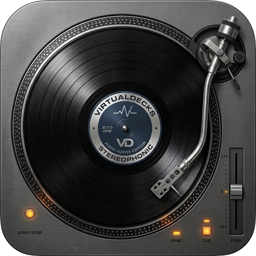

<div align="center">



# OtoDecks

**Professional dual-deck DJ application built with C++17 and the JUCE framework.**

<p align="center">
  
  
  
  
  
  
</p>

</div>

---

## Table of Contents

- [Overview](#overview)
- [Features](#features)
  - [Audio Engine](#audio-engine)
  - [Effects (FX Chain)](#effects-fx-chain)
  - [BPM Detection & Beat Grid](#bpm-detection--beat-grid)
  - [Beat Sync](#beat-sync)
  - [Looping](#looping)
  - [Beat Jump](#beat-jump)
  - [Quantization](#quantization)
  - [Hot Cues](#hot-cues)
  - [Waveform Visualization](#waveform-visualization)
  - [Track Library](#track-library)
  - [Deck Queue](#deck-queue)
- [Architecture](#architecture)
- [Project Structure](#project-structure)
- [Building](#building)
- [Acknowledgments](#acknowledgments)

---

## Overview

OtoDecks is a feature-complete desktop DJ application providing two fully independent playback decks with professional-grade mixing capabilities. Built entirely in C++17 using the JUCE audio framework, it is driven by CMake for cross-platform builds.

The application targets DJs and music enthusiasts who want a performable, hardware-free mixing environment with real-time DSP, beat-aware looping, quantized triggering, a 28-effect FX engine, and automatic BPM analysis - all in a single native binary.

---

## Features

### Audio Engine

Each deck runs an independent `DJAudioPlayer` with the following signal chain:

```
AudioFormatReaderSource
  → AudioTransportSource
  → ResamplingAudioSource      (pitch-preserving speed control)
  → IIR Low Band filter
  → IIR Mid Band filter
  → IIR High Band filter
  → IIR High Pass filter
  → IIR Low Pass filter
  → FxChain (3-slot effects)
  → MixerAudioSource
```

- **Off-thread track loading** - file I/O and format decoding run on a background thread pool; the UI never blocks on disk reads
- **Lock-free UI→audio command FIFO** - 256-slot single-producer/single-consumer ring buffer (`AudioCommandFifo`) bridges slider/button events to the audio thread with zero locking
- **5-band EQ** - independent low, mid, high band IIR shelves plus a combined high-pass/low-pass sweep filter (-20 000 to +20 000 Hz sweep range)
- **Per-deck gain** - separate volume and crossfade gain paths
- **Speed control** - resampling ratio 0.8–1.2× with live BPM readout
- **Headphone cue routing** - `setCueDeck()` taps a deck's processed output into a ring buffer for independent headphone monitoring without affecting the master mix
- **RMS metering** - per-deck level feeds the UI volume meter
- **Crossfader** - master cross-fade slider with configurable gain curves

### Effects (FX Chain)

Each deck carries a **3-slot ordered effects engine** (`FxChain`): Pad → Beat → Release. All 28 effect processors are pre-allocated before audio starts; the audio thread never allocates memory.

| Category | Effects |
|---|---|
| **Pad FX** (7) | Roll, Sweep, Flanger, VinylBrake, Echo, Reverb, RecordEcho |
| **Beat FX** (14) | Delay, Echo, Spiral, Reverb, Trans, Filter, Flanger, Phaser, SlipLoop, Roll, Pitch, LowCutEcho, Helix, MobiusSaw, MobiusTri |
| **Release FX** (3) | VinylBrake, RecordEcho, BackSpin |

- **Pad FX** - momentary (hold to engage, release to disengage)
- **Beat FX** - latched (click to toggle on/off)
- **Release FX** - momentary, triggered on button release
- **BPM sync** - all time-based effects receive live BPM for beat-accurate timing
- **Per-effect parameter modal** - right-click any effect tile to open an editor with sliders for every effect parameter, bypass toggle, and reset-to-defaults

### BPM Detection & Beat Grid

Automatic BPM analysis runs three complementary algorithms across multiple random segments of each loaded track and reaches a consensus:

1. **Bass-energy onset + IOI histogram** - kick-drum focused (60–200 Hz bandpass)
2. **Autocorrelation of onset envelope** - captures rhythmic patterns across the full track
3. **Differential rectified energy autocorrelation** - full-band transient detection

Results are **cached by file-content hash** (`TrackDataCache`) in `~/.otodecks/trackdata/` - analysis only runs once per unique file.

The **Beat Grid** (`{bpm, gridOffsetSecs, isManualBpm, isManualOffset}`) can be:
- Set automatically from the detector
- Corrected manually via the **Beat Grid tab**: BPM editor, nudge left/right, tap tempo, and grid reset

The beat grid is displayed as overlay lines on the waveform and drives all beat-quantized operations.

### Beat Sync

The `BeatSyncManager` provides master/slave cross-deck synchronization:

- One deck is designated **master**; the other engages as **slave**
- **Phase alignment** - on sync engage, the slave's playhead snaps to the master's current beat phase
- **½×/1×/2× multiplier** - slave can track at half or double the master's tempo
- **Continuous tracking** - a timer monitors master speed changes and pushes updated speed to synced slaves in real time
- **Snap granularity** - configurable: 4 beats (1 bar), 2 beats, or 1 beat
- **Status display** - `SYNCED`, `NO BPM`, `OUT OF RANGE`, or empty

### Looping

Full manual loop system with beat-aware resizing:

| Control | Action |
|---|---|
| **IN** | Set loop-in point at current playhead |
| **OUT** | Set loop-out point at current playhead |
| **RELOOP** | Re-enable / disable the active loop |
| **×½** | Halve loop length |
| **×2** | Double loop length |
| **CLR** | Clear all loop points |

The loop region is rendered as a coloured overlay on the waveform and zoomed waveform strip.

### Beat Jump

Eight buttons for instant beat-accurate position jumps: **±1, ±4, ±8, ±16 beats**. Jump distance is calculated from the active beat grid.

### Quantization

All performance actions can be **quantized to the beat grid**. When quantize is active, an action enters a pending state (shown in orange) and fires automatically at the next matching beat boundary.

Quantizable actions:

- Play / Stop
- Loop In / Loop Out
- Loop Halve / Loop Double
- Beat Jump (any distance)
- Hot Cue Jump
- Hot Cue Set

The subdivision selector controls the snap resolution: 1 beat, ½ beat, ¼ beat, etc.

### Hot Cues

Up to **6 colour-coded hot cue points** per deck:

- **Left-click** a set cue button to jump to that position
- **Right-click** for a context menu: Set, Clear, or Go To
- Cue markers are rendered as coloured vertical lines on the waveform
- Cue buttons **flash** as the playhead passes each cue position
- Each cue stores its position in seconds and a unique colour hue

### Waveform Visualization

Three complementary waveform views per deck:

| View | Description |
|---|---|
| **Full Waveform** (`WaveformDisplay`) | Scrollable full-track overview; drag to scrub; renders cue markers, beat grid lines, and loop region overlay |
| **Zoomed Waveform** (`ZoomedWaveform`) | Top-of-screen strip showing a close-up window around the playhead; click to seek |
| **Jog Wheel** (`JogWheel`) | Circular spinning disc with playhead line; drag to scrub; timestamp overlay in centre |

**3-band RGB waveform colouring** - `WaveformBandAnalyzer` runs an offline 3-band IIR analysis (low <500 Hz, mid 500–5 000 Hz, high >5 000 Hz) and stores 4-byte frames at 50 ms resolution. The waveform renders each column tinted by spectral content: **red = bass, green = mids, blue = highs**. Band data is cached alongside BPM data and loads instantly on subsequent plays.

### Track Library

The persistent track library is stored as XML at `~/.otodecks/Resource.xml`.

- **Folder management** - create, rename, remove, and import-from-disk folders
- **Track management** - add files via chooser dialog or drag-and-drop; remove individual tracks
- **Per-deck sidebar** (`DeckLibrarySidebar`) - independent slide-in panel per deck with its own folder/track selection state and live text search
- **Drag-and-drop** - drag tracks from the sidebar directly onto a deck queue
- **Background BPM analysis on import** - newly added tracks are automatically queued for BPM detection; progress is reported to the UI

### Deck Queue

Each deck has an independent track queue (`DeckQueue`):

- Ordered upcoming tracks backed by `std::deque<track>`
- **Left-click** a row to load that track immediately
- **Right-click** for context menu: remove, move up, move down, clear queue
- Accepts drag-and-drop from `DeckLibrarySidebar`
- Displays track index, title, and formatted duration (M:SS)

---

## Architecture

```
OtoDecksApplication  (juce::JUCEApplication)
└── MainWindow        (juce::DocumentWindow)
    └── MainComponent (juce::AudioAppComponent)
         ├── AudioEngine
         │    ├── DJAudioPlayer × 2       - per-deck signal chain + FxChain
         │    └── MixerAudioSource        - mixes both players
         ├── BeatSyncManager              - cross-deck sync timer
         ├── DeckGUI × 2
         │    ├── WaveformDisplay         - full waveform + cue/grid/loop overlays
         │    ├── ZoomedWaveform          - zoomed strip at top of screen
         │    ├── JogWheel                - circular jog display
         │    ├── DeckLibrarySidebar      - slide-in library panel
         │    ├── DeckQueue               - upcoming track list
         │    └── 9-tab control panel
         │         ├── Hot Cues   (6 buttons)
         │         ├── Beat Grid  (BPM editor, tap tempo, nudge)
         │         ├── Beat Jump  (±1/4/8/16)
         │         ├── Loop       (IN/OUT/RELOOP/×½/×2/CLR)
         │         ├── Quantize   (subdivision selector)
         │         ├── Sync       (master/slave, ×½/×1/×2, phase snap)
         │         ├── Pad FX    (7 momentary tiles)
         │         ├── Beat FX   (14 latched tiles)
         │         └── Release FX (3 momentary tiles)
         └── CrossFader slider            - master cross-fade
```

**Waveform component inheritance:**

```
juce::Slider → WaveformDisplay → ZoomedWaveform → JogWheel
```

**Lock-free audio thread safety:**

All UI-to-audio communication passes through `AudioCommandFifo<256>` - a trivially-copyable command struct ring buffer drained at the top of every `getNextAudioBlock`. No mutexes are held on the audio thread.

---

## Project Structure

```
.
├── CMakeLists.txt              - root build config (v0.9.5, FetchContent deps)
├── assets/                     - SVG icons, PNG logo, default font, effects.json
└── src/
    ├── Main.cpp                - application entry point
    ├── MainComponent.*         - root UI, crossfader, audio device setup
    ├── AudioEngine.*           - central audio facade, off-thread loading, cue tap
    ├── AudioCommandFifo.h      - lock-free UI→audio command ring buffer
    ├── DJAudioPlayer.*         - per-deck signal chain, filters, loop, beat jump
    ├── FxChain.h               - 3-slot ordered effects engine
    ├── FxFactory.*             - constructs effect processors from IDs
    ├── FxIds.h                 - 28 effect ID enum
    ├── FxProcessor.h           - abstract base for all DSP processors
    ├── FxParameter.h           - thread-safe named parameter with range/unit
    ├── FxProcessors.h          - all concrete processor implementations
    ├── FxSettings.*            - per-effect parameter persistence
    ├── FxParameterModal.*      - parameter editor popup
    ├── BpmDetector.*           - 3-algorithm BPM analysis
    ├── BpmAnalysisManager.*    - background analysis queue
    ├── BeatGrid.h              - beat grid data struct
    ├── BeatGridConfig.*        - per-track grid JSON persistence (legacy)
    ├── TrackDataCache.*        - hash-keyed BPM + band data cache
    ├── WaveformBandAnalyzer.*  - offline 3-band spectral frame analysis
    ├── BeatSyncManager.*       - cross-deck master/slave sync
    ├── CueAudioCallback.*      - headphone cue tap ring buffer
    ├── DeckGUI.*               - per-deck UI (9 tabs, controls, overlays)
    ├── WaveformDisplay.*       - full waveform component
    ├── ZoomedWaveform.*        - zoomed waveform strip
    ├── JogWheel.*              - circular jog wheel
    ├── DeckLibrarySidebar.*    - per-deck slide-in library panel
    ├── DeckQueue.*             - per-deck upcoming track queue
    ├── Library.*               - folder/track library with XML persistence
    ├── PlaylistComponent.*     - track list within a folder
    ├── Track.h                 - track data struct
    ├── AppSettings.*           - global application settings persistence
    ├── SettingsPanel.*         - settings UI panel
    ├── CustomLookAndFeel.*     - SVG-based custom slider/table rendering
    ├── UIConstants.h           - shared colour constants and layout values
    └── CMakeLists.txt          - source file list, binary data registration
```

---

## Building

Dependencies are fetched automatically via CMake `FetchContent` (JUCE, TagLib, xwax). The first build will take longer while dependencies are downloaded and compiled.

```bash
# Configure
cmake -B build -G Ninja -DCMAKE_BUILD_TYPE=Debug

# Build
cmake --build build

# Run
./build/juceDjApp_artefacts/Debug/juceDjApp
```

**Requirements:**

- CMake 3.25+
- C++17 compiler (GCC 10+ or Clang 12+)
- Ninja (recommended) or Make
- Linux: `libasound2-dev`, `libx11-dev`, `libxext-dev`, `libxrender-dev`, `libxrandr-dev`, `libfreetype6-dev`, `libfontconfig1-dev`

---

## Acknowledgments

- [JUCE Framework](https://juce.com) - audio engine, UI toolkit, and build infrastructure
- [TagLib](https://taglib.org) - audio metadata reading
- [xwax](https://xwax.org) - vinyl emulation algorithms
- [dubstep-warrior/DJDecks](https://github.com/dubstep-warrior/djdecks) - original project
